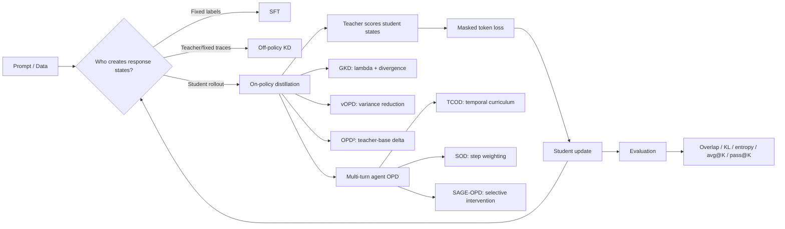

# Curriculum specification

> Status: C2 design contract<br>
> Audience: Python beginners to distillation/RL who learn best by running code<br>
> Tracks: Korean first, mirrored English; fast 2–3h, full 7–9h

## Course-level outcomes

By the end, a learner can:

1. derive and compute CE, forward/reverse KL and generalized JSD;
2. distinguish SFT, off-policy KD, original GKD and modern sampled-token OPD;
3. implement rollout → teacher score → masked loss → update without leaking
   gradients into the teacher;
4. diagnose support mismatch, entropy collapse, high-variance gradients and
   multi-turn error compounding;
5. choose and explain GKD, TCOD, SOD, SAGE-OPD, vOPD or OPD² for a stated
   training situation;
6. run a fair comparison and avoid claiming capability expansion from avg@K alone.

## Lesson map

Each notebook uses the tutorial sequence `Goal → Setup → Steps → Checks → Next
Steps`. The listed demo and check are required in both languages. Code cells are
byte-equivalent after notebook normalization.

| ID | Korean / English title | Path | Prerequisite | Up to three objectives | Required demo | Required check or exercise | Primary sources |
|---|---|---|---|---|---|---|---|
| L00 | 15분 OPD 체험과 전체 지도 / OPD in 15 minutes | fast, full | Python arrays | See the full loop; predict SFT/OPD behavior; choose a path | deterministic categorical SFT vs OPD curve | label each edge of the concept map | course-generated toy; GKD v3 |
| L01 | 토큰·확률·autoregressive LM / Tokens, probabilities, autoregressive LMs | full | L00 | read logits; apply softmax; factor a sequence probability | hand-computed next-token distribution vs PyTorch | shape and causal-prefix quiz | PyTorch docs; GKD §2 |
| L02 | CE, entropy, KL, KD / CE, entropy, KL, and KD | fast, full | L01 | compute CE/KL/JSD; explain direction; recognize mode-covering/seeking | analytic 3-class distribution and plots | swap arguments in intentionally wrong KL code | GKD §3/appendix |
| L03 | SFT·off-policy·on-policy / SFT, off-policy, on-policy | fast, full | L02 | locate training distribution; observe exposure bias; enforce fairness | same-init SFT and off-policy KD on TinyArithmetic | audit token/update budgets | GKD introduction |
| L04 | 원 논문 GKD 해부 / Dissecting original GKD | fast, full | L02–L03 | implement lambda mixing; select generalized JSD; trace gradients | lambda 0/1 and beta boundary sweep | predict which model generated each prefix | GKD Algorithm 1 |
| L05 | 현대 OPD from scratch / Modern OPD from scratch | fast, full | L04 | distinguish full-distribution and sampled-token estimators; mask responses; train safely | end-to-end toy OPD with response masks | annotate tensor shapes and detach points | GKD; modern OPD formulation |
| L06 | 실제 train/eval / Real training and evaluation | full | L05 | preflight hardware; load pinned Qwen/GSM8K; produce checkpoints/reports | toy default, optional Qwen3 LoRA/QLoRA smoke | explain an unsupported QLoRA failure without fallback | HF/PyTorch/PEFT/bnb docs |
| L07 | 왜 성공하거나 실패하는가 / Why OPD succeeds or fails | full | L05 | measure overlap/KL/entropy; reduce variance with vOPD; test recovery recipes | compatible vs incompatible teacher and vOPD gradient variance | diagnose a failed run from metrics | Rethinking OPD v2; vOPD v1 |
| L08 | multi-turn agent OPD / Multi-turn agent OPD | full | L05 | represent turns; observe error compounding; preserve environment state | deterministic calculator environment | find the first corrupted observation/action pair | TCOD/SOD/SAGE introductions |
| L09 | TCOD / Temporal Curriculum OPD | full | L08 | implement depth schedule; compare F2B/B2F; audit slices | same-seed vanilla/F2B/B2F toy runs | reconstruct masks for a truncated trajectory | TCOD v3 + official code |
| L10 | SOD와 SAGE-OPD / SOD and SAGE-OPD | full | L08–L09 | compute step weights; select interventions; normalize loss scale | stable/error/recovery patterns and component ablations | predict weights before execution | SOD v3; SAGE-OPD v1 |
| L11 | 통합 비교와 다음 연구 / Integrated comparison and next research | fast, full | L00–L10 as selected | choose a method; evaluate OPD² language retention; separate avg@K/pass@K | method matrix, OPD² delta toy, K-scaling report | capstone experiment card and decision memo | OPD² + multilingual; test-time scaling v1 |

## Approved additions without course sprawl

- **Rethinking OPD** is diagnostic content in L07, not another trainer notebook.
- **vOPD** is an advanced loss choice in L07; full-vocabulary and top-k baselines
  share the L05 rollout code.
- **OPD² + multilingual** is an advanced L11 section; laptop default uses a tiny
  teacher/base triplet, while the real Qwen recipe is server opt-in.
- **Test-time scaling** becomes the common evaluation harness in L11, not a claim
  that the paper's pass@1024 result was reproduced locally.

## L00 concept map

The Mermaid diagram and text fallback must convey the same relationships. Every later
lesson shows only its current highlighted node plus one predecessor and successor.



Text/alt fallback:

```text
Prompt/Data
  ├─ fixed hard label ───────────────> SFT
  ├─ fixed teacher trace/logits ─────> off-policy KD
  └─ current student rollout ────────> OPD
       └─ teacher scores visited states → response-mask loss → student update
            ├─ GKD: mix state sources and divergences
            ├─ vOPD: reduce sampled-gradient variance
            ├─ OPD²: learn the teacher-vs-base delta
            └─ multi-turn: TCOD / SOD / SAGE-OPD
All routes → fair evaluation: exact match, agreement, KL, entropy, overlap,
             avg@K and pass@K.
```

Alt text: “Three training-state sources lead to SFT, off-policy KD, or OPD. OPD
loops student rollouts through teacher scoring and masked student updates, then branches
into GKD, variance/delta methods, and three multi-turn stabilization methods.”

## Exercise and feedback policy

- Every 5–8 minute micro-section starts with one prediction and ends with a visible
  numeric, textual, or plotted result.
- Each lesson has at least two checks and one optional exercise. Answers live in a
  collapsed `<details>` block after the learner response point.
- Every lesson ends with two to four `mistake-note` items, each containing a wrong
  snippet/equation, explanation, correction and a test ID.
- No lesson depends on a previous notebook kernel. Shared state is reconstructed from
  package functions and a visible config.
- Fast-path optional cells are tagged `advanced` and never block top-to-bottom toy
  execution.
